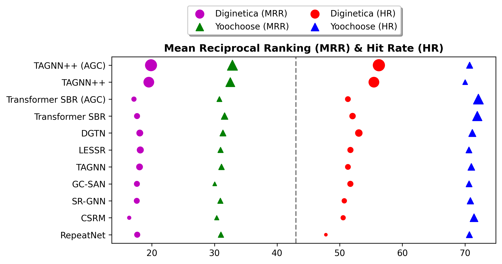

<div align="center">

<samp>
     
# 🛰️ Improved Representation Learning for Session-based Recommendation 📡

    

| **[ [```Model Architecture```](<assets/TAGNN++.png>) ]** | **[ [```Task```](<assets/SBR_Task.png>) ]** 
|:-------------------:|:-------------------:|

  Python implementation for "TAGNN++: Improved Representation Learning for Session-based Recommendation", at ICTIR-2021 (hopefully)
 

---
     
# Results


          

  </samp>  
  
  
  
  </div>  
